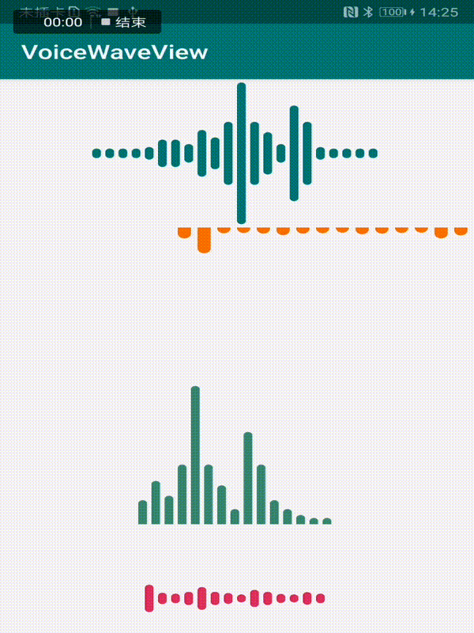

# VoiceWaveView
a voice wave view library

## Screenshot




## Use

属性

 * `addHeader` - 添加图头的线(头尾的线不变化)
 * `addFooter`  - 添加图尾的线(头尾的线不变化)
 * `addBody` - 添加图线
 * `lineSpace` - 线间距
 * `lineWidth` - 线宽
 * `duration` - 动画持续时间
 * `waveMode` - 线条动画模式，`up_down`上线变化，`left_right`从左往右移动
 * `lineColor` - 线条颜色
 * `gravity` - 图的位置，`center`，`bottom`等，同androd gravity

```
<me.xfans.lib.voicewaveview.VoiceWaveView
                android:id="@+id/voiceWaveView0"
                android:layout_width="wrap_content"
                android:layout_height="150dp"
                app:lineColor="@color/colorPrimary"
                app:waveMode="left_right"
                android:gravity="center"
        />
```
```
voiceWaveView?.apply {
            showGravity = Gravity.RIGHT or Gravity.TOP
            waveMode = WaveMode.UP_DOWN
            lineWidth = 30f
            lineSpace = 15f
            duration = 500
            lineColor = Color.parseColor("#F56B00")
            addHeader(4)
            addHeader(14)
            addBody(27)
            addBody(17)
            addBody(38)
            addBody(91)
            addBody(38)
            addBody(24)
            addBody(8)
            addBody(60)
            addBody(38)
            addBody(14)
            addBody(8)
            addFooter(4)
            addFooter(2)
            start()
        }
```
